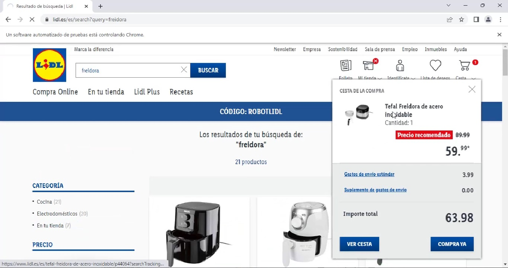



<h1 align="center">Functional Testing JUnit + Selenium</h1>

# Testing Java con pruebas unitarias y prueba global End-to-End sobre la web www.lidl.es

### Descripción General
Este proyecto implementa pruebas funcionales automatizadas para la web de Lidl utilizando Selenium WebDriver y el framework JUnit. El objetivo principal es validar la funcionalidad clave del sitio web, como la búsqueda de productos, la verificación de resultados, y el proceso de agregar productos al carrito de compras.

### Funcionalidades Probadas

- Configuración inicial del WebDriver (ChromeDriver).
Apertura del sitio web de Lidl y aceptación de cookies.

- Búsqueda de Productos:
Uso de la barra de búsqueda para encontrar productos.
Validación del número de productos mostrados en la página de resultados.
Verificación del Título de la Página de Resultados:
Comprobación de que el título de la página de resultados coincide con el esperado: "Resultado de búsqueda | Lidl".

- Adición de Productos al Carrito:
Validación de que es posible añadir un producto al carrito.
Comprobación del contenido del carrito para asegurar que contiene el producto esperado.

- Cierre del navegador al finalizar las pruebas.

### Tecnologías Utilizadas
- **Lenguaje de Programación:** Java 17.
- **Framework de Pruebas:** JUnit 5 (JUnit Jupiter).
- **Automatización del Navegador:**
* Selenium WebDriver (versión 4.8.1).
* WebDriverManager para gestionar el controlador del navegador.
- **Gestión de Dependencias y Construcción:** Maven.
- **Manejo de Logs:** Log4j para registro de eventos y errores.
- **Plugin de Maven:** Surefire para ejecutar los casos de prueba.

### Casos de Prueba:

- Prueba end-to-end que verifica múltiples funcionalidades consecutivas (búsqueda de productos, título de la página, y adición al carrito).
- UnitTest: Contiene pruebas unitarias específicas para funcionalidades individuales.

### Conclusión
Este proyecto automatiza tareas repetitivas y asegura la calidad de las funcionalidades clave de la web de Lidl. La combinación de Selenium WebDriver y JUnit permite un diseño de pruebas modular y robusto, mientras que el uso de Maven y WebDriverManager simplifica la gestión del proyecto.

### Resumen pantallas APP


<h1 align="center">Functional Testing JUnit + Selenium</h1>

